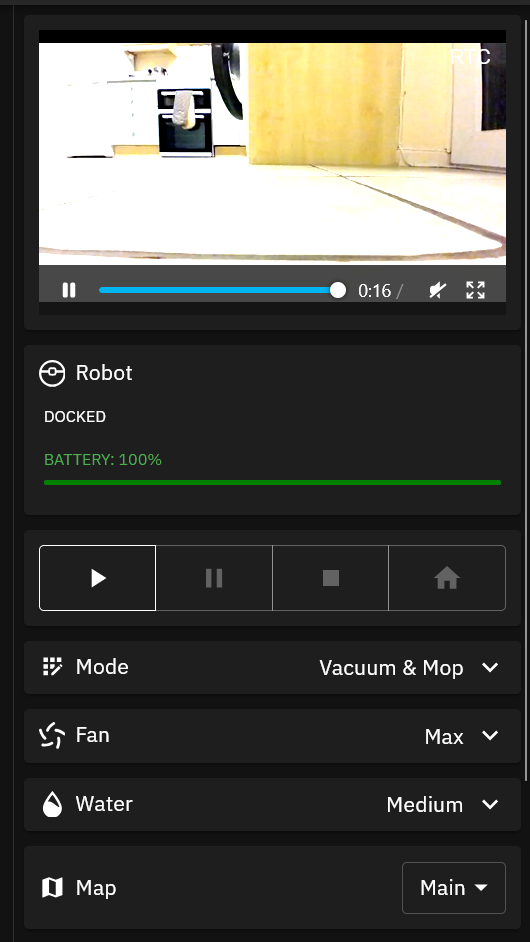
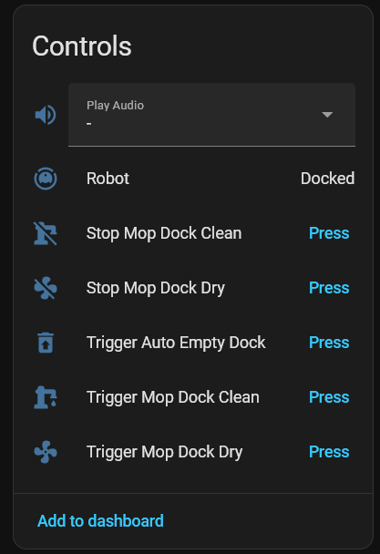
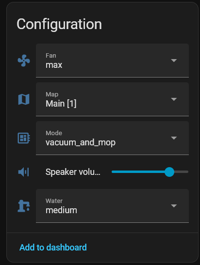
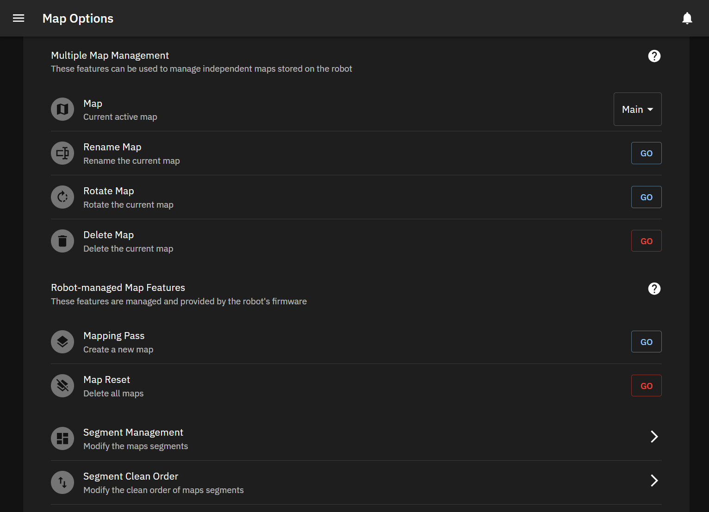
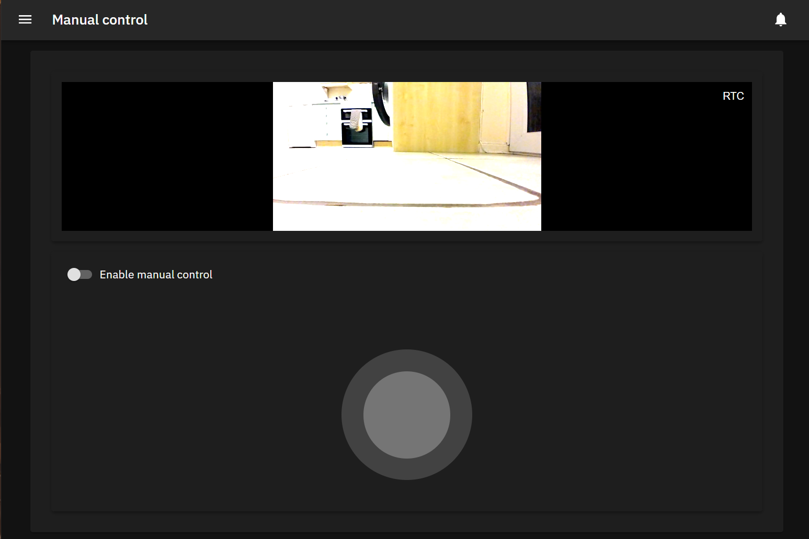

<div align="center">
    
    <p align="center"><h2>Re-free your vacuum from the cloud</h2></p>
</div>

> Fork of [Hypfer/Valetudo](github.com/Hypfer/Valetudo)

Valetudo+ is a fork of Valetudo adding extra functionality I desired that was not offered by the original project. These changes were made initially for the Dreame X40 Ultra. In theory this project should work on any robot Valetudo works on but most of the new functionality will require a supported robot (more details below).

When writing the extra functionality offered by this project I did my best to:
- Make it as easy as possible to pull in changes from upstream in the future.
- Stick to the patterns set in the original project wherever possible.
- Avoid breaking compatibility with other robots even if they don't support some of the features added.

If you want the most polished experience possible I suggest that you stick with the upstream project, this fork has had far less testing and is almost certainly far less polished.

## Before reading on

If you decide to use anything from this fork and run into any issues please do **not** open any issues on the upstream repository and rather open them here. Valetudo exists thanks to the hard work of Hypfer and I don't want to cause him more headaches because of this forks existence.

> **Be warned**: Whilst this code works fine on my vacuum it may not work correctly on yours. Anything you use from this repository is at your own risk and if you break something I may or may not be able to help you. I am far less knowledgeable on the topic of robot vacuums than others and just simply happen to be a software developer who wanted to tweak a great bit of software.

## Added features

Currently new functionality is broken into 2 categories, functionality that should work on all robots and that which will only work on supported devices.

Please read the supported devices section for more information.

### All devices

- HTTPS support with redirection from HTTP to HTTPS when enabled.
- MQTT support for mop cleaning / drying.
- Updated postboot script with iptables rules.
- Various other small tweaks.

### Some devices

- Multiple map / floor capabilities.
- Map rotation.
- Segment clean order.
- View robot camera stream in the UI (via go2rtc).
- On-demand playback of custom audio.
- MQTT support for map switching.
- MQTT support for custom audio playback.
- Exposed a few extra options.

## Supported robots

Below are the robots that the extra functionality offered is currently known to work on.

Some of the functionality such as multiple map support will likely work on other Dreame robots but is currently only enabled for a few robots. If you wish to test it on your vacuum let me know and I can point you in the right direction to try it out.

Please let me know if you have tested this on your robot and what you got working + if you encountered any issues.

- Dreame X40 Ultra
- Dreame X40 Master (Untested but similar to Ultra)

## Screenshots

  



## Installation

Before following these steps it is expected that you have already rooted your vacuum and installed the upstream Valetudo as described by the [original documentation](https://valetudo.cloud/).

### Part 1 (Valetudo+)

1. Get a copy of Valetudo+ from a release build or build your own following instructions under "Development"
2. SCP the Valetudo+ binary to your robot
3. Run `mkdir /data/valetudo`
4. Move the `valetudo` binary into `/data/valetudo`
5. If you have previously run upstream Valetudo be sure to move your config from `/data/valetudo_config.json` to the new `/data/valetudo` folder

### Part 2 (Valetudo+ HTTPS) [Optional]

This project adds HTTPS support to Valetudo, if you wish to use it please follow these steps.

> **Please note**: I would never suggest exposing your vacuum directly to the internet, there are just too many security risks with doing so especially if you are using camera streaming support. A far better option would be to use a VPN into your internal network if you need external access to your vacuum.

1. You will need to acquire a custom certificate to enable HTTPS support. You can either generate a self signed certificate or use something like Let's Encrypt, there are plenty of tutorials online for doing this if you are unsure how.
2. Copy the certificate and key to your robot and place them in `/data/valetudo` calling them `cert.crt` & `key.pem`. You can use custom names or put them in a different location if you desire but you will need to update the config to reflect this.
3. Edit `/data/valetudo/valetudo_config.json` updating the following option:

```
webserver.https.enabled: true
```

Doing this will automatically enforce HTTPS redirection on the HTTP port.

### Part 3 (Vaccumstreamer) [Optional]

These steps adds camera streaming support to Valetudo. It is optional and the camera UI components will automatically be hidden if you choose not to use it.

> **Please note**: The steps use precompiled binaries from the following projects, updated versions can be built / downloaded if required:
> - https://github.com/tihmstar/vacuumstreamer/
> - https://github.com/AlexxIT/go2rtc/

1. Get a copy of streamer.tar.gz from a release build or build your own following instructions under "Development"
2. SCP `streamer.tar.gz` to your robot
3. Run `cd /data/valetudo`
4. Move `streamer.tar.gz` into this directory and run `tar xzf streamer.tar.gz`
5. Remove `streamer.tar.gz` as it is no longer needed
6. Run `cd streamer`
7. Run `cp -r /mnt/private/ mnt_private-copy`
8. Run `touch mnt_private-copy/certificate.bin`
9. Edit `go2rtc.yaml` to update the placeholder RTSP password
10. Run `chmod +x video_monitor go2rtc`

### Part 4 (Custom audio playback) [Optional]

These steps allow for on demand playback of custom audio files should it be desired. It is optional so you can skip these steps if you don't wish to use it.

1. Run `mkdir /data/valetudo/audio` (or let Valetudo create it on startup)
2. Optionally run `cp /audio/{LANG}/* /data/valetudo/audio` to make the default robot audio files available for manual playback
3. Custom audio files can now be added to `/data/valetudo/audio` as desired. They must be mono 16kHz `.ogg` files.

### Part 5 (Final configuration)

These steps will update the `_root_postboot.sh` startup script on the vacuum.

I suggest that you **test** the new commands being added to this script **before** applying it to the main script. This will ensure none of the commands will lock you out of your vacuum, especially the `iptables` rules.

> **Please note**: By default the iptables rules block access to mDNS. You can easily enable this again by uncommenting the line in the script, the same applies for any access you wish to disable - you can simply comment that line out!

1. Edit the file `/data/_root_postboot.sh` on your vacuum
2. Update the file based on the files provided in `resources/postboot` in this project. The content of `extra.sh` should be appended to the end of the script and the old Valetudo startup command removed. There is an example for the Dreame X40 Ultra included in `example.sh`.
3. Reboot the vacuum to test everything is working as expected

## Development

### Setup

You will need a recent LTS version of Node installed before proceeding.

1. Install dependencies `npm install`
2. Run `npm run generate_code --workspace=backend`
3. Run `npm run start:dev --workspace=backend` (this will error and exit)
4. Edit the newly created `./local/valetudo/valetudo_config.json` as suggested:

```
embedded: false,
robot.implementation: "MockValetudoRobot"
webserver.port: 8080
```

It is also possible to create a specific configuration to connect remotely to the robot along the following lines:

```
"implementation": "RoborockS5ValetudoRobot",
"implementationSpecificConfig": {
  "ip": "192.168.xxx.robotIp",
  "deviceId": 12345678,
  "cloudSecret": "aBcdEfgh",
  "localSecret": "123456788989074560w34aaffasf"
}
```

Better instructions can be found here for doing this:
https://valetudo.cloud/pages/development/building-and-modifying-valetudo.html

### Running

If you wish to run the code in development mode for testing you can run:

```
$ npm run watch --workspace=frontend
$ npm run start:dev --workspace=backend
```

Running in this mode the frontend code will automatically rebuild following any code changes and refreshing the page will show changes. 

Code changes to the backend are only applied after it is restarted.

### Building

Build for individual platforms:
```
$ npm run build:aarch64
$ npm run build:armv7
$ npm run build:armv7_lowmem
```

Build for all platforms at once:

```
$ npm run build
```

Build streamer.tar.gz:

```
$ npm run build:streamer
```

All builds can be found in the `build` directory.

### Syncing with upstream

#### Adding upstream

```
$ git remote add upstream https://github.com/Hypfer/Valetudo.git
$ git fetch upstream
```

#### Update from upstream

1. Pull from upstream branch
```
$ git fetch upstream
$ git pull upstream master
```
2. Resolve any conflicts after the pull

### Useful links

Below are a few other resources I found helpful during development:

- [De-clouding Dreame Robot Vacuums](https://anthony-zhang.me/blog/offline-robot-vacuum/)
- [dreame-vacuum (HASS Integration)](https://github.com/Tasshack/dreame-vacuum/)
- [dreame-w10-valetudo-fork](https://github.com/DeutscheKI/dreame-w10-valetudo-fork)